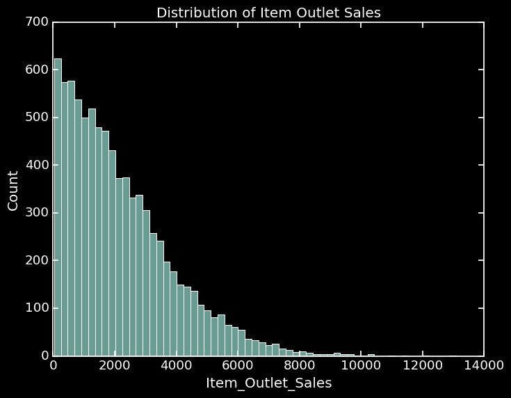
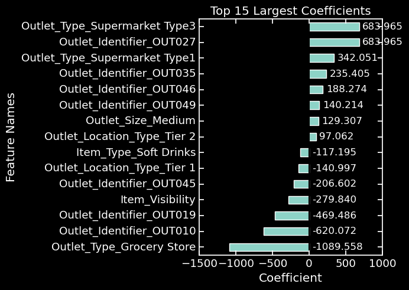
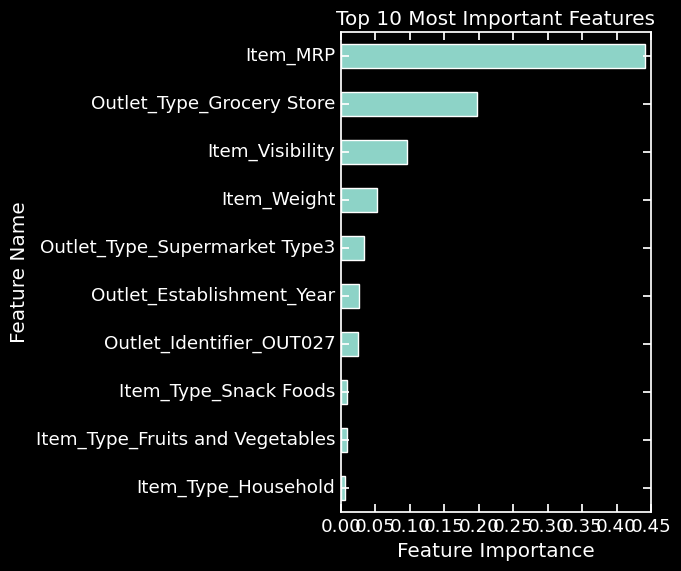
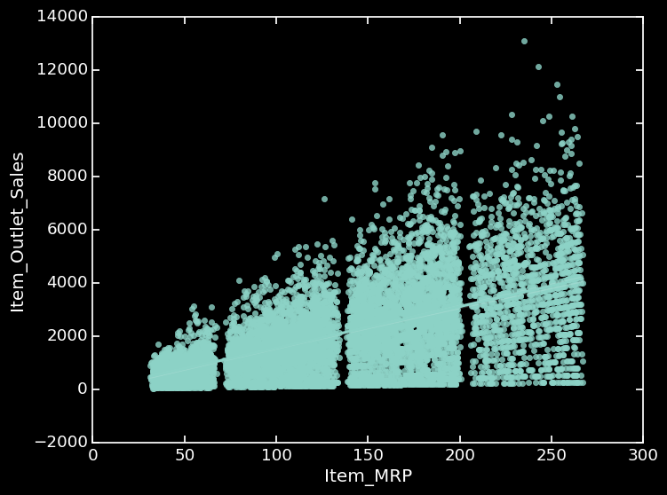
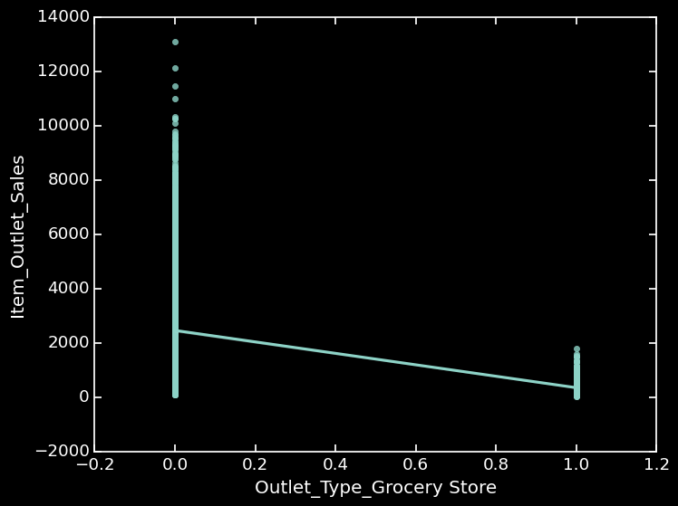
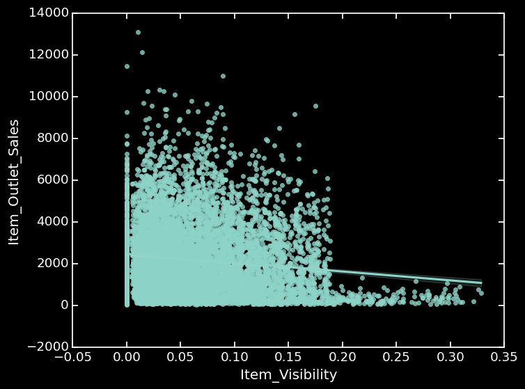
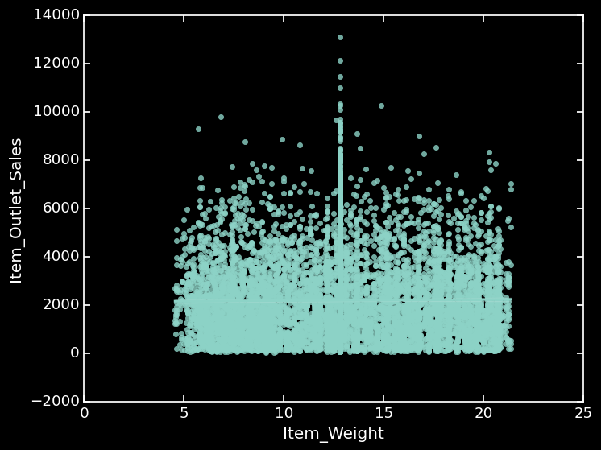
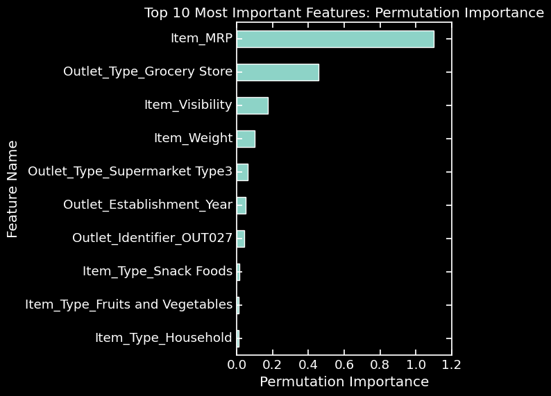
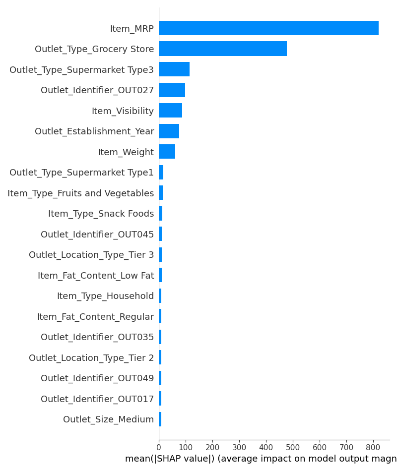
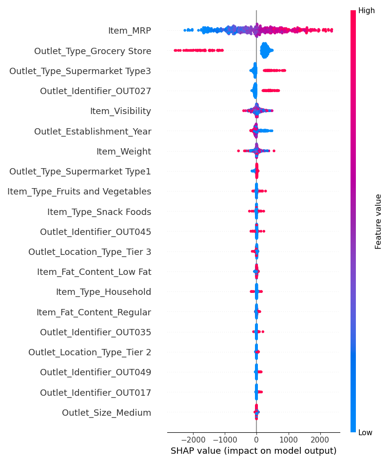

# Food Sales Data Analysis

Our client has tasked us with helping them determine the best ways to optimize sales in the existing locations as well what factors will allow them to establish future food stores with more robust sales outputs.

We were provided a dataset to analyze with the following characteristics in sales distribution:

## Linear Regression Coefficient

                                                     
                                                     

                                              
                                              

